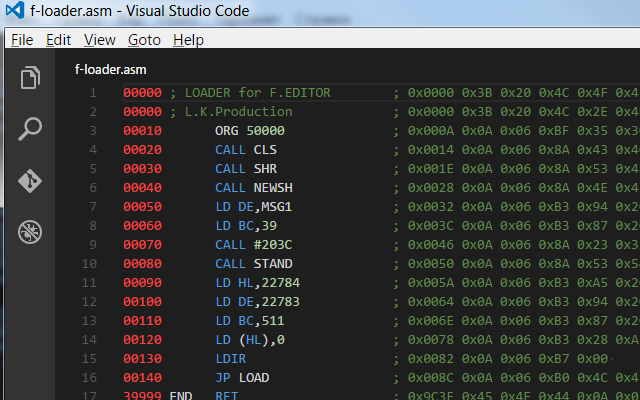

# Zeus Z80 Assembly for Visual Studio Code
This extension adds support for the Zeus Z80 for Spectrum 48k to Visual Studio Code. It works with sources that were generated from the original Zeus Z80 files with help of [ZX Tools](https://github.com/codeatcpp/zxtools).

# Installation

Press `F1` in VSCode, type `ext install` and then look for `Asm (Zeus Z80)`.

# Usage

## Colorization

Full syntax highlight for Zeus Z80 Assembly.
